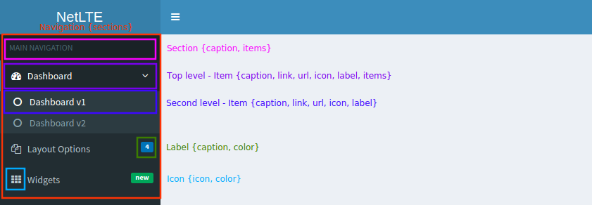

# Netlte > Navigation

## Install

```
composer require netlte/navigation
```

## Tests

Check code quality and run tests
```
composer build
```

or separately

```
composer cs
composer analyse
composer tests
```

## Structure
Navigation have easy structure which should fill most use-cases.
* **Section** - Basic container for menu items
  * **Items** - Links which can have sub-items
    * **Icons** - To provide nice user experience
    * **Badge** - To inform user about something. **(Formerly Label)**
  


## Usage

### Manager

This class is used for define navigation structure. It supports icons, badges, menu items, sections etc.
You can define item activation rules and render conditions.

Manager have only one property and it is `sections` which is array of [`\Netlte\Navigation\ISection`](../src/ISection.php).

#### Example
This example create instance of [`\Netlte\Navigation\Manager`](../src/Manager.php). Define **main** section, add first level item and two second level items into it.
As you can see it there's defined active conditions too by **Nette** links.
```php
<?php

/** @var $presenter \Nette\Application\UI\Presenter */
$presenter;
$manager = new \Netlte\Navigation\Manager();

$section = $manager->createSection('main', 'MAIN NAVIGATION');

$item = $section->createItem('dashboard', 'Dashboard')
    ->setIcon('dashboard')
    ->addActiveCondition(function() use ($presenter): bool{
        return $presenter->isLinkCurrent(':Homepage:*');
    })
    ->addRenderCondition(function() use ($presenter): bool{
        return $presenter->getUser()->isAllowed('homepage', 'read');
    });

$item->createItem('v1', 'Dashboard v1')
    ->setLink('Homepage:default')
    ->addActiveCondition(function() use ($presenter): bool{
        return $presenter->isLinkCurrent('Homepage:default');
    });

$item->createItem('v2', 'Dashboard v2')
    ->setLink('https://google.com/')
    ->setUrl(); // default is `true`
```

##### Properties
###### Section
* `caption` - String for display in view (to hide use `null`)
* `items` - array of [`\Netlte\Navigation\IItem`](../src/IItem.php)

###### Items
* `caption` - String for display in view
* `link` - This can be absolute or relative URL, url fragment or Nette link
* `url` - Boolean(default is `false`) used to define if `link` property should be directly passed to view or over `\Nette\Application\UI\Presenter::link()` method
* `icon` - Define icon and color for view
  * internally using instance of [`\Netlte\Navigation\Item\IIcon`](../src/Item/IIcon.php)
  * Default icon provider is [FontAwesome](https://adminlte.io/themes/AdminLTE/pages/UI/icons.html) (Do **NOT** use `fa-` prefix with default template)
* `badge` - Define badge on right side of navigation item with color and some string
  * internally using instance of [`\Netlte\Navigation\Item\ILable`](../src/Item/ILabel.php)
* `items` - array of [`\Netlte\Navigation\IItems`](../src/IItem.php) subitems.
* `activeConditions` - array of `callable` method to define if item is active or not
  * if any callback return `true` item is active
* `renderConditions` - array of `callable` method to define if item should be rendered or not (user permission for example)
  * if any callback return `false` item is not render


##### Conditions
```php
/** @var $presenter \Nette\Application\UI\Presenter */
$presenter;
$manager = new \Netlte\Navigation\Manager();

$section = $manager->createSection('main', 'MAIN NAVIGATION');

$item = $section->createItem('dashboard', 'Dashboard')
    ->setIcon('dashboard')
    ->addActiveCondition(function() use ($presenter): bool{
        return $presenter->isLinkCurrent(':Homepage:*');
    });

$item->createItem('v1', 'Dashboard v1')
    ->setLink('Homepage:default')
    ->addActiveCondition(function() use ($presenter): bool{
        return $presenter->isLinkCurrent('Homepage:default');
    });
```

_OR you can define first level item's active condition by theirs children_

```php
/** @var $presenter \Nette\Application\UI\Presenter */
$presenter;
$manager = new \Netlte\Navigation\Manager();

$section = $manager->createSection('main', 'MAIN NAVIGATION');

$item = $section->createItem('dashboard', 'Dashboard')
    ->setIcon('dashboard');

$subitem = $item->createItem('v1', 'Dashboard v1')
    ->setLink('Homepage:default')
    ->addActiveCondition(function() use ($presenter): bool{
        return $presenter->isLinkCurrent('Homepage:default');
    });

$item->addActiveCondition(function() use ($item): bool{
        foreach ($item->getItems() as $subitem) {
            if ($subitem->isActive()) return true;
        }
        return false;
    });
```
### Navigation
[`\Netlte\Navigation\Navigation`](../src/Navigation.php) is standard `Nette\Application\UI\Control` extended by `Netlte\UI\AbstractControl`. Component accept only one property and it's [`\Netlte\Navigation\IManager`](../src/IManager.php).
Default template supports `Nette\Localization\Translator` for translating captions and can be overridden for global scope by changing static template path in `\Netlte\Navigation\Navigation::$DEFAULT_TEMPLATE` or dynamically in runtime by
```php
/** @var \Netlte\Navigation\Navigation $navigation */
$navigation->setTemplateFile('/path/to/yours/template.latte');
```

### Nette
Just modify your `config.neon` by adding extension. It will register [`\Netlte\Navigation\Manager`](../src/Manager.php) as `\Nette\DI\Container` service so you can autowire it in any factory or presenter and modify navigation structure.
```neon
extensions:
	navigation: Netlte\Navigation\Bridges\Nette\NavigationExtension
```

## Development
All structure class have their interface, so you easily change behavior including main template file. 

More examples are in [tests](../tests/) or in [sandbox](https://github.com/Netlte/Sandbox) project app.
